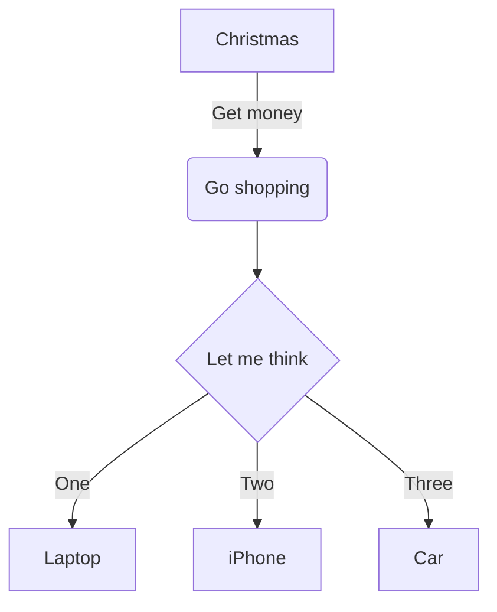

# 日课


> 一个人的前程，往往全靠他怎样利用闲暇时间，闲暇定终生。

*每天腾出一小时来，完善自己的技术栈*

## 先开一个坑，vuepress
> 用vuepress搭一个github上的博客，同时作为样本深入学习下vue。

### 2019.10.20
> yarn global add vuepress # 全局安装vuepress

> 从我的blog起步，可以git clone https://github.com/flyingtimes/blog

> 然后 yarn install && vuepress dev docs 

要学习如何做theme，首先可以**弹出**一份default的theme做参考，导出方法集成在vuepress-cli里面了
```
vuepress eject docs
```
这时候在项目docs路径下会产生一个新的theme路径
```
docs
    .vuepress
    L theme
        L components
        L global-comonents
        L layouts
        L util
        index.js
```

在docs/.vuepress/config.js中声明：我们要在default主题上扩展自定义主题
``` js {2}
module.exports = {
extend: '@vuepress/theme-default'
    ...
}
```
::: warning
eject以后，原来的default主题就失效了，页面主题都以docs/.vuepress/theme为准
:::
ok，现在可以开始尝试对default主题做一些修改了
例如，要修改home页面hero图片为圆角，可以在docs/.vuepress/components/Home.vue中添加一行
``` js {7}
  .hero
    img
      max-width: 100%
      max-height 280px
      display block
      margin 3rem auto 1.5rem
      border-radius 50px
    text-align center
```
要修改代码的底色，可以在 docs/.vuepress/styles/code.styl 中修改颜色
``` js {3}
div[class*="language-"]
  position relative
  background-color  #389d70
```
### 2019.10.21
昨天基本搞清楚如何做自定义theme了，下来研究一下，vuepress的内部机制是如何发挥作用的。可以参考简书作者云峰的文章。

[深入浅出 VuePress（一）：如何做到在 Markdown 中使用 Vue 语法](https://www.jianshu.com/p/c7b2966f9d3c)

[深入浅出 VuePress（二）：使用 Webpack-chain 链式生成 webpack 配置](https://www.jianshu.com/p/a63b55b1d9cc)

[深入浅出 VuePress（三）：使用 markdown-it 解析 markdown 代码](https://www.jianshu.com/p/a95c04a68d14)

[深入浅出 VuePress（四）：插件系统](https://www.jianshu.com/p/b8000f6b24da)

### 2019.10.22
#### 改变markdown-it现实的效果
在vuepress 中使用的markdown插件，是markdown-it,在vuepress文档中有介绍，可以做一些配置，markdown-it本身还可以做插件扩展。

https://vuepress.vuejs.org/zh/guide/markdown.html#%E8%BF%9B%E9%98%B6%E9%85%8D%E7%BD%AE

如果仅仅是要改变markdown的渲染效果，这个在vuepress的主题样式里面修改，位置在docs/.vuepress/theme/style/index.styl中
``` js {5,6,10,11}
h2
  font-size 1.65rem
  padding-bottom .3rem
  border-bottom 1px solid $borderColor
  // 改变## 的颜色
  color #3eaf7c

h3
  font-size 1.35rem
  // 为 ### 添加下划线效果 
  text-decoration underline
```
#### 添加mermaid流程图组件
在page.vue中引入
```js {3,7,9}
 <template> 
  <main class="page">
    <mermaid />
    </main>
</template>
<script>
import mermaid from '../components/mermaid.vue'
export default {
  components: { PageEdit, PageNav,List,mermaid },
  ...
}
</script>
```
添加组件mermaid.vue
```
<template>
</template>

<style>
div.language-mermaid {
  background-color: inherit
}
</style>

<script>
export default {
  beforeMount() {
    import("mermaid/dist/mermaid").then(m => {
      m.initialize({
        startOnLoad: true
      });
      m.init('div.language-mermaid>pre>code');
    });
  }
};
</script>
```
这样你就可以在md中使用流程图了
```

具体使用方法在这里有说明
https://github.com/knsv/mermaid

#### 添加一个列出所有文章的控件的方法
首先修改Page.vue,在其中加入List控件的呈现功能
``` js {5,13,16}
<template>
  <main class="page">
    ...
    <Content class="theme-default-content" />
    <List v-if="$page.frontmatter.showList"/>
    ...
  </main>
</template>

<script>
import PageEdit from '@theme/components/PageEdit.vue'
import PageNav from '@theme/components/PageNav.vue'
import List from '../components/List.vue'

export default {
  components: { PageEdit, PageNav,List },
  props: ['sidebarItems']
}
</script>
```
然后增加一个List.vue控件
```js
<template>
  <div>
    <div class="article" v-for="page in files">
      <a v-bind:href="page.path">{{page.title}}</a>
      <div class="keywords">
        <span class="keyword" v-for="key in page.frontmatter.keywords">{{key}}</span>
      </div>
    </div>
  </div>
</template>
<script>
export default {
  computed: {
    files() {
      return this.$site.pages
        .filter(p => { 
          return (!p.frontmatter.home) && (!p.showList);
        });
    }
  }
}
</script>
<style scoped>
  ...
</style>
```
最后就可以增加md页面了
```
---
showList: true
---
```
### 2019.10.22

#### 为自己的blog添加基于travis的持续集成
首先要在github上设置一个personal access token，为token取一个变量名，例如mytoken
https://github.com/settings/tokens

然后添加一个部署文件 travis-deploy.sh
```sh
cd docs/.vuepress/dist
git init
git add -A
git commit -m 'deploy'
git push -f https://${mytoken}@github.com/flyingtimes/blog.git master:gh-pages
```
最后添加travis的配置文件
```yaml
language: node_js
node_js:
  - "8.15.1"

cache:
  directories:
    - "node_modules"

branches:
  only:
    - master

install:
  - npm install -g vuepress
  - npm install
  - vuepress build docs
  
script:
  - bash ./travis_deploy.sh

```