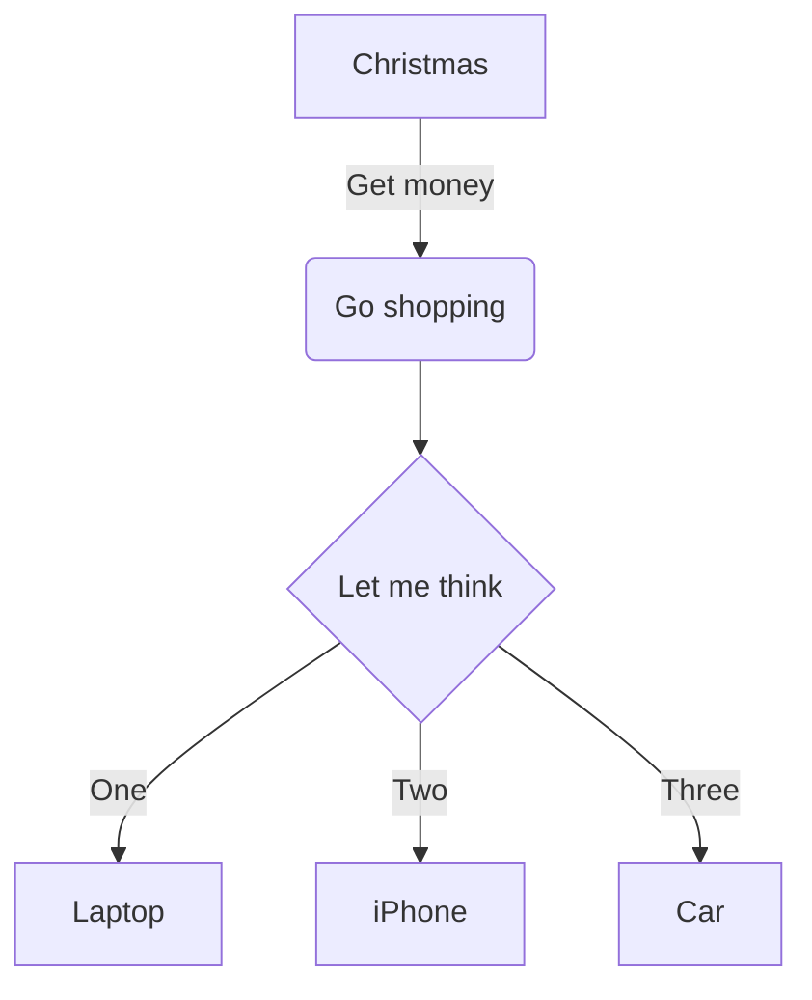
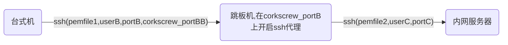
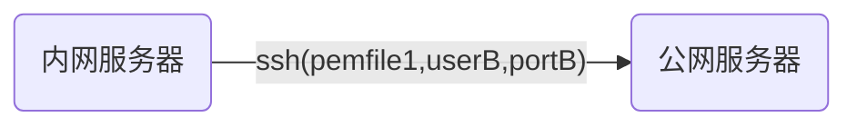

# 日课


> 一个人的前程，往往全靠他怎样利用闲暇时间，闲暇定终生。

*每天腾出一小时来，完善自己的技术栈*

## 先开一个坑，vuepress
> 用vuepress搭一个github上的博客，同时作为样本深入学习下vue。

### 2019.10.20
> yarn global add vuepress # 全局安装vuepress

> 从我的blog起步，可以git clone https://github.com/flyingtimes/blog

> 然后 yarn install && vuepress dev docs 

要学习如何做theme，首先可以**弹出**一份default的theme做参考，导出方法集成在vuepress-cli里面了
```
vuepress eject docs
```
这时候在项目docs路径下会产生一个新的theme路径
```
docs
    .vuepress
    L theme
        L components
        L global-comonents
        L layouts
        L util
        index.js
```

在docs/.vuepress/config.js中声明：我们要在default主题上扩展自定义主题
``` js {2}
module.exports = {
extend: '@vuepress/theme-default'
    ...
}
```
::: warning
eject以后，原来的default主题就失效了，页面主题都以docs/.vuepress/theme为准
:::
ok，现在可以开始尝试对default主题做一些修改了
例如，要修改home页面hero图片为圆角，可以在docs/.vuepress/components/Home.vue中添加一行
``` js {7}
  .hero
    img
      max-width: 100%
      max-height 280px
      display block
      margin 3rem auto 1.5rem
      border-radius 50px
    text-align center
```
要修改代码的底色，可以在 docs/.vuepress/styles/code.styl 中修改颜色
``` js {3}
div[class*="language-"]
  position relative
  background-color  #389d70
```
### 2019.10.21
昨天基本搞清楚如何做自定义theme了，下来研究一下，vuepress的内部机制是如何发挥作用的。可以参考简书作者云峰的文章。

[深入浅出 VuePress（一）：如何做到在 Markdown 中使用 Vue 语法](https://www.jianshu.com/p/c7b2966f9d3c)

[深入浅出 VuePress（二）：使用 Webpack-chain 链式生成 webpack 配置](https://www.jianshu.com/p/a63b55b1d9cc)

[深入浅出 VuePress（三）：使用 markdown-it 解析 markdown 代码](https://www.jianshu.com/p/a95c04a68d14)

[深入浅出 VuePress（四）：插件系统](https://www.jianshu.com/p/b8000f6b24da)

### 2019.10.22
#### 改变markdown-it现实的效果
在vuepress 中使用的markdown插件，是markdown-it,在vuepress文档中有介绍，可以做一些配置，markdown-it本身还可以做插件扩展。

https://vuepress.vuejs.org/zh/guide/markdown.html#%E8%BF%9B%E9%98%B6%E9%85%8D%E7%BD%AE

如果仅仅是要改变markdown的渲染效果，这个在vuepress的主题样式里面修改，位置在docs/.vuepress/theme/style/index.styl中
``` js {5,6,10,11}
h2
  font-size 1.65rem
  padding-bottom .3rem
  border-bottom 1px solid $borderColor
  // 改变## 的颜色
  color #3eaf7c

h3
  font-size 1.35rem
  // 为 ### 添加下划线效果 
  text-decoration underline
```
#### 添加mermaid流程图组件
在page.vue中引入
```js {3,7,9}
 <template> 
  <main class="page">
    <mermaid />
    </main>
</template>
<script>
import mermaid from '../components/mermaid.vue'
export default {
  components: { PageEdit, PageNav,List,mermaid },
  ...
}
</script>
```
添加组件mermaid.vue
```
<template>
</template>

<style>
div.language-mermaid {
  background-color: inherit
}
</style>

<script>
export default {
  beforeMount() {
    import("mermaid/dist/mermaid").then(m => {
      m.initialize({
        startOnLoad: true
      });
      m.init('div.language-mermaid>pre>code');
    });
  }
};
</script>
```
这样你就可以在md中使用流程图了
```

具体使用方法在这里有说明
https://github.com/knsv/mermaid

#### 添加一个列出所有文章的控件的方法
首先修改Page.vue,在其中加入List控件的呈现功能
``` js {5,13,16}
<template>
  <main class="page">
    ...
    <Content class="theme-default-content" />
    <List v-if="$page.frontmatter.showList"/>
    ...
  </main>
</template>

<script>
import PageEdit from '@theme/components/PageEdit.vue'
import PageNav from '@theme/components/PageNav.vue'
import List from '../components/List.vue'

export default {
  components: { PageEdit, PageNav,List },
  props: ['sidebarItems']
}
</script>
```
然后增加一个List.vue控件
```js
<template>
  <div>
    <div class="article" v-for="page in files">
      <a v-bind:href="page.path">{{page.title}}</a>
      <div class="keywords">
        <span class="keyword" v-for="key in page.frontmatter.keywords">{{key}}</span>
      </div>
    </div>
  </div>
</template>
<script>
export default {
  computed: {
    files() {
      return this.$site.pages
        .filter(p => { 
          return (!p.frontmatter.home) && (!p.showList);
        });
    }
  }
}
</script>
<style scoped>
  ...
</style>
```
最后就可以增加md页面了
```
---
showList: true
---
```
### 2019.10.23

#### 为自己的blog添加基于travis的持续集成
首先要在github上设置一个personal access token，为token取一个变量名，例如mytoken
https://github.com/settings/tokens

然后添加一个部署文件 travis-deploy.sh
```sh
cd docs/.vuepress/dist
git init
git add -A
git commit -m 'deploy'
git push -f https://${mytoken}@github.com/flyingtimes/blog.git master:gh-pages
```
最后添加travis的配置文件
```yaml
language: node_js
node_js:
  - "8.15.1"

cache:
  directories:
    - "node_modules"

branches:
  only:
    - master

install:
  - npm install -g vuepress
  - npm install
  - vuepress build docs
  
script:
  - bash ./travis_deploy.sh

```
OK，现在整个个人博客已经搭建好了，而且每一次对于master分支的提交，都会触发一次网站的构建。博客可以随时向全世界发布。
用手机打开github网页版，愉快的编辑你的md文件吧，现在这一段就是我在地铁上完成的。

为了使项目更美观一点，在github的readme首页，可以添加持续集成的徽章。
在https://blog.csdn.net/gdky005/article/details/73330332 这篇有详细的介绍
## ssh 访问内部网络
### 2019.10.24
#### 通过跳板机登陆内网


```
Host B
   HostName     B's IP
   Port         portB
   User         userB
   IdentityFile         ~/.ssh/pemfile1.pem
Host C
   HostName     C's IP
   Port         portC
   User         userC
   IdentityFile         ~/.ssh/pemfile2.pem
   ProxyCommand         ssh B nc %h %p
```
#### 跳板机不对外开放ssh，但有一个web端口开放


使用corkscrew，可以在服务器上将web端口复用一个ssh代理，具体做法是在apache上添加配置文件/etc/httpd/conf.d/proxy.conf

```xml
<VirtualHost _default_:corkscrew_portBB>
    ProxyRequests on
    ProxyVia block
    AllowCONNECT 22
    <Proxy *>
        # Deny all proxying by default ...
        Require all granted
    </Proxy>
    <Proxy 127.0.0.1>
        # Now allow proxying through localhost only
        Require all granted
    </Proxy>
</VirtualHost>
```
这样一来，跳板机的corkscrew_portBB端口一方面可以提供http web 服务，另一方面通过这个端口将ssh代理到跳板机本地的22端口。
在客户端上，可以brew install corkscrew下载客户端，并修改配置文件
```
Host B
   HostName     127.0.0.1
   Port         portB
   User         userB
   IdentityFile   ~/.ssh/pemfile1.pem
   ProxyCommand   corkscrew B的外部ip corkscrew_portBB %h %p
```
#### 将内网服务器的一个app服务暴露到台式机上
```sh
# 第一组localhost:portDesktop 代表台式机上面暴露的端口
# 第二组localhost:portC 代表远端服务器上面的一个app服务
ssh -fNL localhost:portDesktop:localhost:portC serverC
```
现在，访问本机器localhost:portDesktop端口，就相当于访问serverC:portC

#### 将内网服务器，暴露到公网


```sh
ssh -fNR portB:localhost:portA userB@B 
```
## 将vuejs前端项目变成跨平台手机端app
### 2010.10.26
一个普通的vuejs项目，一般是跑在浏览器上的。cordova可以通过打包技术，在app中预先开启一个浏览器，并自动打开vuejs编译好的h5。通过cordova-plugin，还可以调用手机的各类传感器、gps数据，从而实现用js模拟一个app应用。这种技术可以使一个前端vuejs开发人员，低成本的变成一个手机端开发人员。


学习的话，可以先从这个项目开始
https://github.com/flyingtimes/cordova-vue-startup.git

#### 准备工作
```
# 安装cordova，vue工具
npm install -g cordova
npm install -g vue
npm install -g vue-cli
# 为cordova 添加不同平台的编译能力
cordova platform add ios 
cordova platform add android
# 在本路径下创建一个完整的vue项目，myapp
vue init webpack myapp
cd myapp
```
在myapp目录下，要修改一下build这个动作的输出(config/index.js)，将输出发布到项目根目录的www路径下
```js 
build:{
...
index:  => '../../www/index.html'
assetsRoot:  => '../../www'
assetsPublicPath:  => ''
}
事实上，目录结构不一定按照本项目来，最主要的就是要将index、assetsRoot、PublicPath改到cordova的www目录下，便于打包。
```
#### 开发vuejs手机端应用
现在你可以在myapp基础上，扩展你的应用内容
#### 编译
```
cd myapp
npm run build
cd ../
cordova build ios #或者
cordova build android
```
#### 手机端编译
如果是web或者android，只要android开发环境装好了，那就可以直接出来apk或者h5的内容了。但是如果是ios，还需要在xocde里面，打开编译好的路径，再用xcode编译一次。这样才能大功告成。

## 如何自己写一个npm 的模块
### 2019.11.6

> 要坚持写日课还挺难的，一眨眼又停更了1周。佩服那些每天写小说的。

#### 几个必须的步骤需要准备
* 到npmjs.org注册账号
* npm login 自己的账号
* registry要设置到官网
* npm init(每次修改要执行，并更新版本号)
* npm publish

举个例子，你创建一个模块项目,在根目录生产index.js
```js
function print(name) {
  console.log('you enter name is :%s', name);
};
module.exports = print;
```
然后注册你的这个模块your-module
```sh
npm init
npm publish
```
npm init的时候会问一些个人信息，模块信息，回答完毕后就发布啦
这时候，在任何你的项目里面可以下载这个模块了
```sh
npm install your-module
```
main.js
```js
const print = require('your-module');
print('welcome you!');
```
####  包不需要的时候想要删除
```sh
npm unpublish your-module --force 
```
> 按照上面的思路，我成功的发布了我的第一个模块，这是一个markdown-it 插件，https://github.com/flyingtimes/markdown-it-alarm

### 2020.2.1
#### 用rsync将目录备份到远程服务器
新冠病毒阴霾下，突然发现自己已经停更了三个月了。惭愧惭愧。
```
rsync -av --progress [src_dir] user@host/[work_path]
例如:
rsync -av --progress . root@naslocal/root/Rsync/

```

### 2020.2.10
#### 一个好的php入门网站

https://laravel-china.github.io/php-the-right-way/

#### laravel 控制反转相关内容
https://segmentfault.com/a/1190000015072320