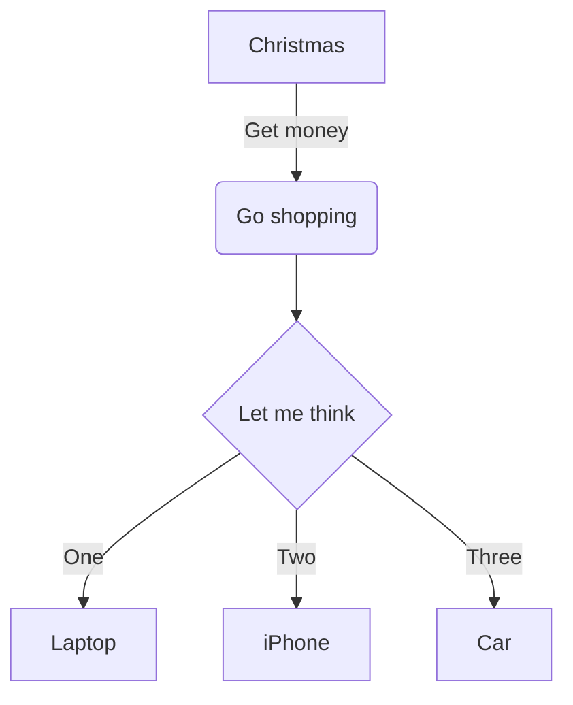

# 一些md的样例

### memarid


### 代码段示例

<CodeSwitcher :languages="{js:'MAC',ts:'WINDOWS'}">
<template v-slot:js>

```js
module.exports = function (str) {
    return typeof str === 'string' && str.trim() === str
}
```

</template>
<template v-slot:ts>

```ts
export default function isString (str: string) : str is string {
    return typeof str === 'string' && str.trim() === str
}
```

</template>
</CodeSwitcher>

### a2

### a3

## test2

### b1

### b2

### b3

## test3

### c1

### c2

### c3